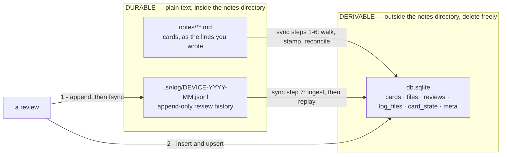

# Data model

Three stores, only two of which are durable.

| Store | Location | Durable? |
|---|---|---|
| Card content | the user's notes, as the lines they wrote | yes |
| Review history | `<notes>/.sr/log/<device>-YYYY-MM.jsonl` | yes |
| Everything else | the vault's `dbPath` — `~/.local/share/geodemd/db.sqlite` for the first vault | no — a cache |

**All three are per vault** ([ADR 0027](../decisions/0027-vaults.md)). A vault is one notes folder and one database, and nothing crosses between vaults: a card's history is in its own vault's `.sr/log/`, and its database never holds another vault's rows. That is why two vaults may not overlap — the same stamped line in two vaults would split its history across two logs — and why `core` and `store` did not change when vaults arrived. A `Core` was always one folder and one database; there is simply one per vault now, one open at a time.



Two things the arrows are saying.

**Everything flows left to right.** Nothing in `db.sqlite` originates there, which is why `rebuild` can drop every table and arrive at a byte-identical database. See [ADR 0001](../decisions/0001-plain-text-is-the-durable-store.md).

**`reviewCard` writes the log before the database**, and the numbering is the ordering. A crash between the two leaves a review in the log and not in SQLite, which the next ingest repairs. The reverse order loses it outright.

## The review log

`src/files/index.ts` owns it. One append-only JSONL file per device per month; one line per review:

```json
{"card":"sr-a7Kd9mQ2xR4v","at":"2026-09-02T18:41:07.324Z","rating":3,"elapsed":12.1,"scheduled":21.4}
```

- `at` is **always** ISO-8601 UTC with exactly three fractional digits and a trailing `Z`. Fixed-width UTC sorts lexicographically, so ordering is free in SQL and JS — but mixing precisions breaks it silently, since `Z` sorts after `.`.
- `elapsed` and `scheduled` exist for a future FSRS optimizer. **No code path reads them back**, and they are mirrored into no table. Both are *omitted* on a card's first review rather than written as `0`, so readers must treat them as optional.
- Writes are `O_APPEND`, one `write()` per review, `fsync` before SQLite is touched.
- Uniqueness is `(card_id, rated_at)`. `device` names the file and appears in the line but is **never part of identity**.

`reviewCard` appends to the log first, then updates SQLite. A crash between the two leaves a review in the log and not the database, and the next ingest folds it in. See [ADR 0005](../decisions/0005-append-only-review-log.md).

## The schema

`src/store/index.ts` is the only module that touches it.

```sql
CREATE TABLE cards (
  id         TEXT PRIMARY KEY,
  file_path  TEXT NOT NULL,   -- relative to notesPath
  line_no    INTEGER,         -- display only; refreshed each sync
  question   TEXT NOT NULL,
  answer     TEXT NOT NULL,
  type       TEXT NOT NULL DEFAULT 'basic',
  reviewed   INTEGER NOT NULL DEFAULT 0
);
CREATE INDEX idx_cards_path ON cards(file_path, line_no);
CREATE INDEX idx_cards_new  ON cards(file_path, line_no) WHERE reviewed = 0;

CREATE TABLE files (              -- the incremental-sync cache
  path      TEXT PRIMARY KEY,
  mtime_ms  INTEGER NOT NULL,
  size      INTEGER NOT NULL
);

CREATE TABLE reviews (            -- an INDEX over the JSONL logs
  card_id  TEXT NOT NULL,
  rated_at TEXT NOT NULL,
  rating   INTEGER NOT NULL,
  PRIMARY KEY (card_id, rated_at)
) WITHOUT ROWID;

CREATE TABLE log_files (          -- a read cursor, nothing more
  name    TEXT PRIMARY KEY,
  size    INTEGER NOT NULL,
  offset  INTEGER NOT NULL
);

CREATE TABLE card_state (         -- replay reviews through the scheduler
  card_id     TEXT PRIMARY KEY,
  due         TEXT NOT NULL,
  stability   REAL,
  difficulty  REAL,
  reps        INTEGER NOT NULL DEFAULT 0,
  lapses      INTEGER NOT NULL DEFAULT 0,
  state       INTEGER NOT NULL,
  last_review TEXT,
  learning_steps INTEGER NOT NULL DEFAULT 0   -- which short-term step it is on
);
CREATE INDEX idx_state_due ON card_state(due);

CREATE TABLE meta (               -- facts about the cache, derived from the code
  key   TEXT PRIMARY KEY,         -- today only 'scheduler'
  value TEXT NOT NULL
);
```

### Why the tables are shaped this way

**`files` is a rowid table on purpose.** A `TEXT PRIMARY KEY` leaves the implicit rowid in place, and [sync](sync.md) step 6 marks a bitmap indexed by rowid to find vanished files without a second walk. Do not "optimize" it to `WITHOUT ROWID`.

**`reviews` is `WITHOUT ROWID` and carries three columns.** Every access is "the rows for this card, in `rated_at` order", so `(card_id, rated_at)` is the natural key and storing rows inside that B-tree rather than beside it halves the storage and makes a card's history a contiguous range scan. The log's `device`, `elapsed` and `scheduled` are deliberately not mirrored here — a column no code path reads is pure cost in a table that reaches eight figures of rows.

There is **no autoincrement id**, and its absence is load-bearing: such a column reflects *ingest* order, and a log arriving three days late inserts older reviews after newer ones. With no column, the mistake of ordering a replay by it is unrepresentable.

**No foreign key on `reviews.card_id`.** Reviews outlive the cards they refer to. Never filter the log by what `cards` currently holds.

**`cards.reviewed` is a deliberate denormalization** — the one place the schema stores a fact twice. The [review flow](review-flow.md) needs the first fifty never-reviewed cards in path order, and the honest query is an anti-join against `card_state`, which in a collection where 900,000 of a million cards are reviewed walks 900,000 index rows before finding fifty. With `reviewed` it is a partial index and O(log n) regardless of size.

It must be set on insert from `EXISTS(SELECT 1 FROM card_state WHERE card_id = ?)`, never defaulted — a restored card has state and must not re-enter the queue as new.

**`card_state.learning_steps` is FSRS-6's step counter.** Under `learning_steps: ["1m", "10m"]` a card rated `3` moves to the second step, and its next rating is scheduled from there — so without the column, a replayed card and an incrementally folded one would disagree. It is replayed from the log like every other column, so the rebuild guarantee holds. A database from before the column existed has it added on open (`addMissingColumns`) with a placeholder `0`, which the scheduler check below overwrites before anything reads it.

**`meta` records which scheduler derived `card_state`.** See [Scheduler state](#scheduler-state).

**`type` is defaulted to `'basic'` and nothing branches on it.** It exists so a future card taxonomy has somewhere to land without a migration.

## Connection settings

```
journal_mode = WAL        synchronous = NORMAL
busy_timeout = 5000       cache_size  = -32000   (~32 MB)
```

WAL plus the busy timeout let a `sync` started while a `review` session is open block briefly instead of failing. `synchronous = NORMAL` is safe under WAL and keeps a bulk sync from fsyncing per statement — the durability that matters lives in the log, which fsyncs explicitly, so the database can afford to be the fast half.

Every write path runs in a transaction with prepared statements, cached in `Store`. At a million cards this is not a micro-optimization: autocommit-per-statement is the difference between seconds and hours.

## Scheduler state

`card_state` is a function of replaying `reviews` through `FsrsScheduler`, which implements a two-method interface and names itself:

```ts
interface Scheduler {
  initial(now: Date): CardState;
  next(state: CardState, rating: 1 | 2 | 3 | 4, now: Date): CardState;
  readonly version: string;   // what derived a state; see "When the scheduler changes"
}
```

It is FSRS-6, from `ts-fsrs` 5.4.2. Its parameters — all 21 weights, `request_retention`, `maximum_interval`, `enable_fuzz: false`, `enable_short_term`, `learning_steps` and `relearning_steps` — are written out literally in source rather than inherited from `ts-fsrs`, and the dependency is pinned to an exact version. This is what makes replay deterministic, and therefore what makes the rebuild test possible. See [ADR 0007](../decisions/0007-pin-fsrs-parameters-in-source.md) for the rule and [ADR 0028](../decisions/0028-move-to-fsrs-6.md) for the version and the weights.

The weight vector is 21 long on purpose. Given 19, `ts-fsrs` 5 does not fail: it pads the vector to 21 itself, which would be FSRS-5's weights on FSRS-6's engine.

### When the scheduler changes

`card_state` is a fold of the history *under a particular scheduler*, so a database only means what it says while the scheduler that derived it is the one running. `SCHEDULER_VERSION` in `src/scheduler/` names it — the `ts-fsrs` version plus every parameter, so any change to either changes it without anyone having to remember to — and `meta` holds the version that derived the database.

`Core.adoptScheduler(now)` compares the two. When they differ it re-derives every row of `card_state` from zero, from that card's full history in `reviews`, and records the new version in the same transaction as the last batch. It runs in batches of 2,000 with the event loop let back in between, and a run cut short leaves the old version recorded, so the next open starts again rather than trusting half of one. A database with no version and no schedules is new, and only has the version recorded.

It re-derives `card_state` only: not a rebuild. It walks no notes, rereads no log, and writes no stamps. What it produces for each card is what a rebuild's replay would, because both are the same fold over the same history. The rows for cards that have gone from `cards` are re-derived too — `card_state` outlives its card on purpose, and a restored card must come back with the new scheduler's schedule, not the old one's.

The app runs it when it opens a vault (`Active.ensure`), before any read. The renderer asks for the result once, on arriving at a vault, and shows `host`'s `rescheduledText` as a note, because due dates that move without a word look like lost reviews. `rebuild` records the current version itself, since everything it derives is derived by that scheduler. Why a re-derivation and not an automatic rebuild is in [ADR 0028](../decisions/0028-move-to-fsrs-6.md).

## Rebuild

`rebuild` drops every table and runs a full sync — steps 1 through 8, stamp writes included, so a card authored while the database was gone still gets its ID. It is a normal sync against an empty database, not a separate code path, which is the only reason it can be trusted to stay working.

Because nothing in the schema is non-derivable, it recovers the database *completely*, which is why the rebuild test asserts full-table equality with no carve-outs. `meta` is derived from the code rather than from the notes or the log, like the schema itself; a rebuild writes the running scheduler's version into it.

At the top of the scale range it is minutes, not milliseconds. It is the recovery path; the [incremental sync](sync.md) is the daily one.
