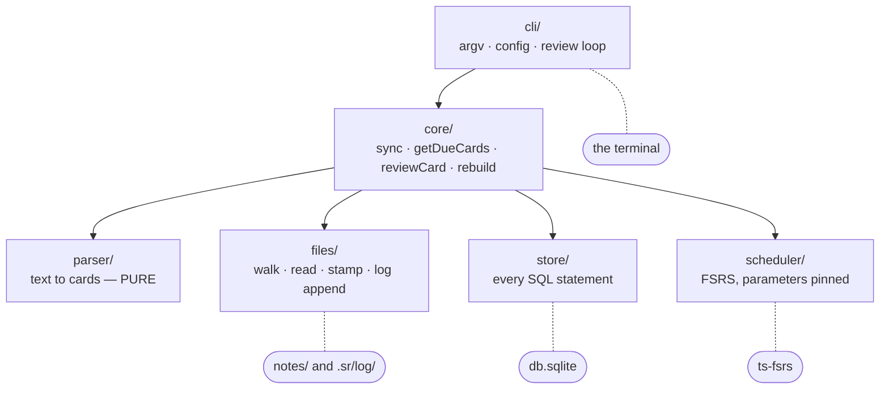

# Module map

How the source is divided, and what each division is protecting.

## The modules



Solid arrows are imports; they run one way and never back. Dotted lines mark the **sole owner** of an external resource — no other module may reach that thing at all.

```
src/
  parser/     text -> cards            PURE: no fs, no db, no clock
  files/      the only module that touches the filesystem, log included
  store/      the only module that touches SQLite
  scheduler/  ts-fsrs behind a two-method interface
  core/       the Core class; orchestration
  cli/        argv, config, terminal I/O
  index.ts    the public API: re-exports Core, Store, FsrsScheduler, parser fns
```

Note what the diagram does *not* contain: an arrow from anything back into `cli`, or a second line touching any of the four external resources. Both absences are asserted by `boundaries.test.ts`.

## One module per external resource

Each external thing the program touches has exactly one module that knows about it. SQLite lives in `store/` and nowhere else — no other module imports `better-sqlite3` or contains SQL. The filesystem lives in `files/`, and that **includes the review log**, despite the log holding review history: filing it under `store/` would put `fsync` and `O_APPEND` in the module whose only job is SQLite.

`parser/` touches nothing. It takes a string and returns objects, which is what makes it exhaustively testable with fixture strings and reusable by a future editor plugin.

## Ambient state is injected

`core` reads no ambient config — not `process.env`, not the clock, not a random source. `now: Date` is a parameter on every `Core` method; `newId: () => string` is supplied by the caller. `cli` defaults them to the real clock and `nanoid`.

This is not purity for its own sake. Without it, two whole classes of test cannot be written: asserting that stamping is idempotent needs predictable IDs, and asserting that a card comes due needs to fast-forward past its interval.

## `core` returns data

`core` never prints, never exits, never prompts. Long operations take an optional `onProgress(done, total, phase)` callback rather than writing to the terminal — at the top of the scale range a sync runs for seconds and a rebuild for minutes, so `cli` renders a counter from it.

Inside `cli`, the same split repeats one level down: `render.ts` builds strings and `index.ts` decides when to print them; `editor.ts` keeps `resolveEditor` and `editorCommand` pure and confines the `spawn` to one function. The payoff is that output and editor-command construction are tested without a pseudo-terminal.

## Three types cross the boundaries

```ts
interface ParsedCard {
  id: string | null;   // null until minted
  question: string;
  answer: string;
  lineIndex: number;   // 0-based; authoritative for the stamp write
}

interface CardState {
  due: string; stability: number; difficulty: number;
  reps: number; lapses: number; state: number; last_review: string | null;
}

interface DueCard {
  id: string; question: string; answer: string;
  filePath: string; lineNo: number | null;
  locator: string;   // "algorithms/Sorting.md:142" — display only
}
```

`ParsedCard.lineIndex` is authoritative — it is what the stamp write targets. `cards.line_no` is a display convenience refreshed each sync, and `DueCard.locator` is built from it. They are two different things and only one is safe to build on, which is why a card that moved since the last sync shows a stale line rather than failing.

## Enforcement

None of the above is convention. `src/boundaries.test.ts` scans source text and fails on violations: an import of `cli` from below, `console.*` or `process.env` in `core`, `better-sqlite3` or raw SQL outside `store/`, a clock in `parser/`, `fsync` in `store/`, unpinned scheduler parameters.

It strips comments before matching, because these modules *document* the rules they obey and a naive scan would fail on the prose rather than on a violation.

Note that this runs as a **test**, not as a compile step. `npm run build` is `tsc` and will happily compile a boundary violation; `npm test` is what catches it.

The reason this is enforced rather than trusted: `core` is meant to serve **two** interfaces — this CLI and a planned Electron app — permanently, with neither replacing the other ([ADR 0013](../decisions/0013-cli-and-electron-are-peers.md)). If these rules hold, the second interface is `core` plus a renderer. If they don't, it is a rewrite, and the CLI is stuck carrying logic the GUI needs.

That also sets where new code goes: anything both interfaces would want belongs in `core`, not in whichever one asked for it first.

See [ADR 0006](../decisions/0006-module-boundaries-enforced-by-test.md).
