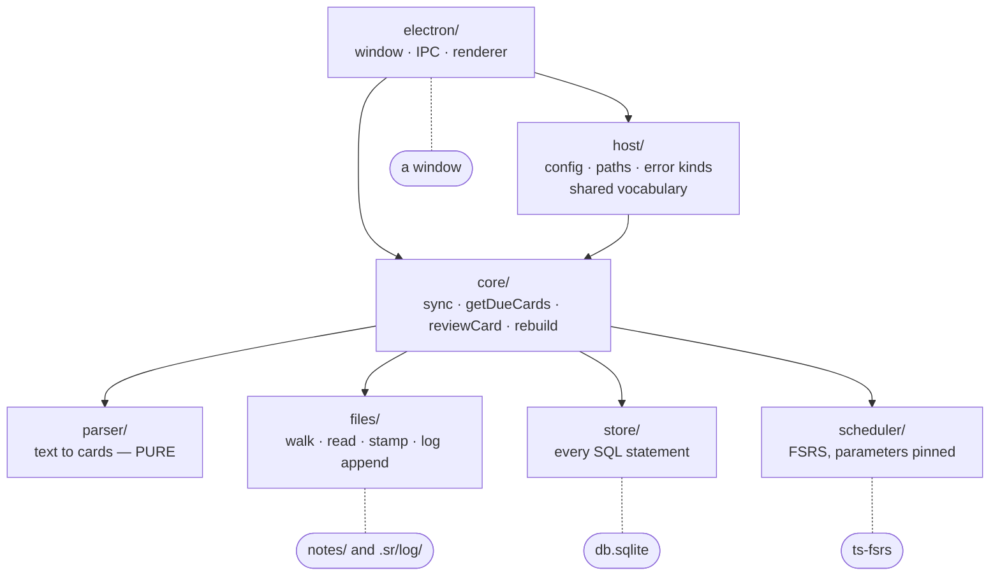

# Module map

How the source is divided, and what each division is protecting.

## The modules



Solid arrows are imports; they run one way and never back. Dotted lines mark the **sole owner** of an external resource — no other module may reach that thing at all.

`electron` is the only interface ([ADR 0025](../decisions/0025-the-app-is-the-only-interface.md), which removed the CLI and records what that cost). It still sits behind `host` rather than reaching past it, because the decisions in `host` are worth keeping out of a renderer whether or not anything else consumes them. The line between `host` and `core` is ambient state — `host` may read `process.env`, `os.hostname()` and the config file; `core` may read none of it and takes everything as arguments ([ADR 0016](../decisions/0016-config-lives-in-host.md)).

```
src/
  parser/     text -> cards            PURE: no fs, no db, no clock
  files/      the only module that touches the filesystem, log included
  store/      the only module that touches SQLite
  scheduler/  ts-fsrs behind a two-method interface
  core/       the Core class; orchestration. Knows only its arguments
  host/       this machine: XDG paths, env, hostname, config, error kinds
              shared vocabulary: keys, summary fields, the review queue
  electron/   window, IPC contract, renderer      the other
  measure/    the scale harness: what it measures, and what builds the collection
  index.ts    the public API: re-exports Core, Store, FsrsScheduler, parser fns
```

Note what the diagram does *not* contain: an arrow from anything back into `electron`, or a second line touching any of the four external resources. Both absences are asserted by `boundaries.test.ts`.

## One module per external resource

Each external thing the program touches has exactly one module that knows about it. SQLite lives in `store/` and nowhere else — no other module imports `better-sqlite3` or contains SQL. The filesystem lives in `files/`, and that **includes the review log**, despite the log holding review history: filing it under `store/` would put `fsync` and `O_APPEND` in the module whose only job is SQLite.

`parser/` touches nothing. It takes a string and returns objects, which is what makes it exhaustively testable with fixture strings and reusable by a future editor plugin.

## Ambient state is injected

`core` reads no ambient config — not `process.env`, not the clock, not a random source. `now: Date` is a parameter on every `Core` method; `newId: () => string` is supplied by the caller. The app supplies the real clock and `host`'s id minter.

This is not purity for its own sake. Without it, two whole classes of test cannot be written: asserting that stamping is idempotent needs predictable IDs, and asserting that a card comes due needs to fast-forward past its interval.

## `core` returns data

`core` never prints, never exits, never prompts. Long operations take an optional `onProgress(done, total, phase)` callback rather than writing to the terminal — at the top of the scale range a sync runs for seconds and a rebuild for minutes, so the app renders a progress bar from it.

Inside `electron`, the same split repeats one level down: `main/runs.ts` holds single-flight and the progress throttle with no Electron imports at all, and `renderer/model/` holds the screens' decisions as pure functions. The payoff is that both are tested without a running app.

Opening a note is the same split drawn across a boundary instead of inside one file. `host/editor.ts` holds the pure half — `resolveEditor`, `editorCommand`, the `+142` / `--goto` / `:142` tables, and the `OpenedNotes` mtime record — and `electron/main/open.ts` holds the `spawn`, which is `detached` + `unref` and `stdio: "ignore"`: a GUI has no TTY to hand over and must not block for as long as a note stays open. A failure comes back as a `Result` and is shown as a dim note, because failing to open a note must never cost the session.

`host` spawns nothing at all, which is what kept it usable from two interfaces and what would keep it usable from a third. `boundaries.test.ts` asserts both halves — that the interface carries no editor table, and that `host` imports no `child_process`.

The same split runs through everything `host` holds. Each row is one question with one answer, and every one of them was in an interface before a second one needed it — which is why they read as decisions rather than as helpers:

| In `host` | Left to the interface |
|---|---|
| `RATING_KEYS`, `interpretKey` — what `3` does, whether `escape` quits | drawing a legend in CSS |
| `resolveEditor`, `editorCommand` — which program `o` opens | the `spawn`, and whether to wait for it |
| `OpenedNotes` — the mtime-at-open record | the sentence that reports it |
| `summaryFields` — which counts a sync reports, in order | laying them out as a grid |
| `deferralReason` — why a file was left alone | what to do about it |
| `PHASE_LABEL` — what `scan`/`prune`/`ingest` are called | where the bar goes |
| `countText` — how a count that stopped at the cap is written | which tile it sits in |
| `queue.ts` — which card is next, and when a rated card comes back | a state machine in the renderer |

**One interface consumes these now**, and the rules are kept anyway ([ADR 0025](../decisions/0025-the-app-is-the-only-interface.md)). The failure mode has changed rather than gone: it used to be two interfaces each staying perfectly self-consistent while disagreeing with each other, and it is now a decision arriving inside a component with a layout attached, where it stops looking like a decision at all. The second is quieter and no easier to find.

## Three types cross the boundaries

```ts
interface ParsedCard {
  id: string | null;   // null until minted
  question: string;
  answer: string;
  lineIndex: number;   // 0-based; authoritative for the stamp write
}

interface CardState {
  due: string; stability: number; difficulty: number;
  reps: number; lapses: number; state: number; last_review: string | null;
}

interface DueCard {
  id: string; question: string; answer: string;
  filePath: string; lineNo: number | null;
  locator: string;   // "algorithms/Sorting.md:142" — display only
}
```

`ParsedCard.lineIndex` is authoritative — it is what the stamp write targets. `cards.line_no` is a display convenience refreshed each sync, and `DueCard.locator` is built from it. They are two different things and only one is safe to build on, which is why a card that moved since the last sync shows a stale line rather than failing.

## Enforcement

None of the above is convention. `src/boundaries.test.ts` scans source text and fails on violations: an import of the interface from below, `console.*` or `process.env` in `core`, `better-sqlite3` or raw SQL outside `store/`, a clock in `parser/`, `fsync` in `store/`, unpinned scheduler parameters.

It strips comments before matching, because these modules *document* the rules they obey and a naive scan would fail on the prose rather than on a violation.

Note that this runs as a **test**, not as a compile step. `npm run build` is `tsc` and will happily compile a boundary violation; `npm test` is what catches it.

The reason this is enforced rather than trusted has now been tested twice, in opposite directions. `core` was written to serve two interfaces so that adding the second one was a renderer rather than a rewrite; when the CLI was **removed** instead ([ADR 0025](../decisions/0025-the-app-is-the-only-interface.md)), nothing below the interface line changed at all — one directory deleted, no logic rescued from it. A boundary that survives both adding and removing an interface is doing the job it was drawn for.

That also sets where new code goes: anything that is a decision rather than a drawing belongs in `core` or `host`, not in the renderer that asked for it first.

See [ADR 0006](../decisions/0006-module-boundaries-enforced-by-test.md).
